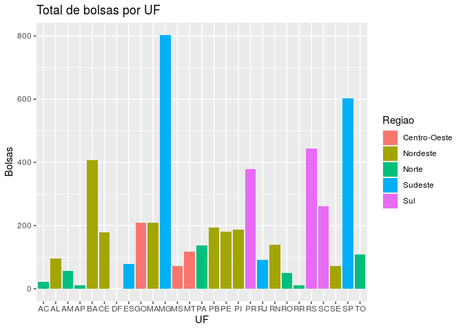

Trabalho Final
================
Julia Marques, Letícia Dufloth, Pedro Paulo Polastri e Rodrigo Prates
18/07/2020

### Introdução

O presente trabalho se configura como o trabalho final da disciplina de
Análise e Visualização de Dados com R, do Curso Superior de
Administração Pública da Escola de Governo Professor Paulo Neves de
Carvalho da Fundação João Pinheiro, referente ao primeiro semestre de
2020. Neste trabalho, temos por objetivo analisar dados relativos às
bolsas concedidas pelo ProUni (Programa Universidade para Todos), bem
como o perfil de seus beneficiários.

O ProUni é um programa do Ministério da Educação que concede bolsas de
estudo em instituições de ensino superior particulares. Para as bolsas
integrais, os alunos precisam comprovar renda familiar bruta mensal per
capita de até 1,5 salário mínimo. Para as bolsas parciais (50%), os
estudantes têm que comprovar renda familiar bruta mensal per capita de
até 3 salários mínimos. Além disso, é necessário que o aluno não tenha
diploma de ensino superior, e que tenha realizado o Exame Nacional do
Ensino Médio (ENEM) mais recente (BRASIL, 2020).

As questões que orientarão as análises do presente trabalho são:

  - Qual o perfil demográfico dos bolsistas, no que se refere a gênero,
    raça, faixa etária e existência de deficiência?

  - Como se dá a distribuição geográfica dos bolsistas por unidade
    federativa?

  - Quais os 10 cursos que recebem mais bolsistas ProUni?

### Perfil dos bolsistas

Os dados disponíveis na base permitem fazer análises interessantes
quanto ao perfil dos beneficiários acerca do sexo, da faixa etária, da
raça e da existência de deficiência física.

No que se refere à faixa etária, foi necessário criar dois tipos de
gráficos. Isso porque verificou-se a existência de um outlier -
constava na base de dados uma pessoa com 11 anos de idade, sendo que
todos os outros beneficiários tinham 16 anos ou mais. Sendo assim,
primeiramente será mostrado o gráfico com a inclusão do outlier e,
posteriormente, será exibido o gráfico excluindo o outlier, para
evidenciar a mudança na visualização.

Ressalta-se que, nos gráficos em que a variável faixa etária não estiver
sendo analisada, o outlier será incluído, pois pressupõe-se que a única
informação errada referente a essa pessoa é a idade.

<!-- --><!-- -->

Observa-se que a maior parte dos beneficiários está na faixa etária
entre 16 a 20 anos, e o número de beneficiários a cada faixa etária
seguinte vai diminuindo.

Também é possível fazer visualizações a partir da combinação da variável
faixa etária com a variável sexo:

<!-- --><!-- -->

Nota-se, nesses gráficos, um comportamento semelhante aos gráficos
anteriores, sendo que o número de mulheres por faixa etária é quase
sempre maior do que o de homens. Os homens predominam apenas nas faixas
etárias de 66 a 70 anos e na de 71 anos ou mais.

No que se refere à variável “sexo” analisada individualmente, observa-se
a predominância de mulheres beneficiárias:

<!-- -->

Ao relacionar as variáveis sexo e raça, observamos que as mulheres
beneficiárias predominam em todas as raças, exceto quando a raça não foi
informada (nesse caso, são 4 homens e 1 mulher):

<!-- -->

Sendo assim, percebe-se que a maior parte dos beneficiários é mulher
parda, seguida de mulheres brancas, homens pardos e homens brancos.

Ao analisar a variável raça isoladamente, verifica-se que a raça parda é
a predominante dentre os beneficiários, seguida pela raça branca, preta,
amarela e indígena:

<!-- -->

Quanto à análise de dados referentes aos beneficiários com deficiência
física, nota-se que eles são uma pequena parcela do total de
beneficiários:

<!-- -->

Dessa forma, entende-se ser interessante filtrar somente os
beneficiários com deficiência para fazer algumas análises combinadas
com outras variáveis. No que se refere à raça, vê-se que a predominante
dentre os beneficiários é a branca, seguida pela parda, preta e amarela:

<!-- -->

Verifica-se que a raça branca predomina dentre os beneficiários com
deficiência, embora a raça predominante analisada individualmente seja a
parda.

Também é possível observar, ao analisar o gráfico referente ao sexo dos
beneficiários com deficiência, uma dissonância quanto à variável sexo
analisada isoladamente, haja vista que o sexo masculino predomina:

<!-- -->

### Distribuição Geográfica

Diante da disponibilidade dos dados dos municípios, UF’s e regiões
relativas à origem dos beneficiários das bolsas, podemos analisar a
distribuição da concessão dessas ao redor do país, a partir de
diferentes pontos.

Primeiramente, é possível perceber os beneficiários originários de
capitais é quase insignificante comparado aos demais municípios.

    ## `summarise()` regrouping output by 'Municipio', 'UF' (override with `.groups` argument)

    ## `summarise()` ungrouping output (override with `.groups` argument)

<!-- -->

Quanto aos beneficiários por UF e Região, observa-se as seguintes
distribuições:

    ## `summarise()` ungrouping output (override with `.groups` argument)

<!-- -->

    ## `summarise()` regrouping output by 'UF' (override with `.groups` argument)

<!-- -->

É possível perceber que as regiões com maior volume de bolsas concedidas
são a Nordeste e a Sudeste, respectivamente, ambas com mais de 1.500
beneficiários, ao passo que a região Sul fica em terceiro lugar com mais
de 1.000 e a Centro-Oeste e a Norte ficam por último e bem distantes das
demais, com 400 e 395, respectivamente.

Quanto aos estados, Minas Gerais apresenta o maior número de bolsas, com
aproximadamente 800, seguido de São Paulo, com aproximadamente 600, o
que explica a colocação da região Sudeste. Por outro lado, O Distrito
Federal (Centro-Oeste) fica em última posição, com apenas uma bolsa, ao
passo que as próximas 5 UFs com menor número correspondem a 5 das 7 UFs
que compõem a região Norte, o que também explica a posição dessa região.

Porém, os valores absolutos das regiões e dos estados podem ser
decorrentes das diferenças demográficas entre eles, de maneira que é
mais pertinente a análise da distribuição relativa.

### Cursos Predominantes

Os dados analisados trazem a relação dos cursos de cada um dos bolsistas
do programa. A partir disso, questionamos a possibilidade de se analisar
quais eram os cursos que mais recebiam bolsistas e se essa informação
poderia suscitar maiores indagações ou apresentar qualquer padrão.

Abaixo estão os 10 cursos que mais receberam bolsas:

<table>

<thead>

<tr>

<th style="text-align:left;">

Cursos

</th>

<th style="text-align:right;">

Bolsas Concedidas

</th>

</tr>

</thead>

<tbody>

<tr>

<td style="text-align:left;">

Administração

</td>

<td style="text-align:right;">

18884

</td>

</tr>

<tr>

<td style="text-align:left;">

Pedagogia

</td>

<td style="text-align:right;">

17076

</td>

</tr>

<tr>

<td style="text-align:left;">

Direito

</td>

<td style="text-align:right;">

16983

</td>

</tr>

<tr>

<td style="text-align:left;">

Ciências Contábeis

</td>

<td style="text-align:right;">

11337

</td>

</tr>

<tr>

<td style="text-align:left;">

Enfermagem

</td>

<td style="text-align:right;">

9293

</td>

</tr>

<tr>

<td style="text-align:left;">

Educação Física

</td>

<td style="text-align:right;">

9230

</td>

</tr>

<tr>

<td style="text-align:left;">

Psicologia

</td>

<td style="text-align:right;">

7140

</td>

</tr>

<tr>

<td style="text-align:left;">

Gestão De Recursos Humanos

</td>

<td style="text-align:right;">

6048

</td>

</tr>

<tr>

<td style="text-align:left;">

Engenharia Civil

</td>

<td style="text-align:right;">

5966

</td>

</tr>

<tr>

<td style="text-align:left;">

Fisioterapia

</td>

<td style="text-align:right;">

5518

</td>

</tr>

</tbody>

</table>

Verifica-se, portanto, que os cursos predominantes são de áreas
diversas, e que não seguem um padrão ou tendência observável, o que,
naturalmente, é benéfico para uma politica pública que tem o intuito de
ser inclusiva.

Todavia, é importante salientar que os dados colocam limitações para
análise: necessitam de padronização, uma vez que foram encontrados
diversas grafias para um mesmo curso (que incluíam até mesmo as
localidades dos campus onde são lecionados) e encontramos diversas
linhas em branco, sem qualquer informação.

### Referências

BRASIL. Ministério da Educação. **ProUni - Programa Universidade Para
Todos**. Disponível em: <http://prouniportal.mec.gov.br/>. Acesso em 18
jul. 2020.
