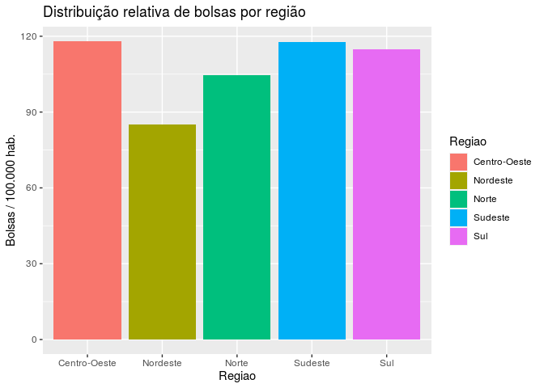

Trabalho Final
================
Julia Marques, Letícia Dufloth, Pedro Paulo Polastri e Rodrigo Prates
18/07/2020

## Introdução

O presente trabalho se configura como o trabalho final da disciplina de
Análise e Visualização de Dados com R, do Curso Superior de
Administração Pública da Escola de Governo Professor Paulo Neves de
Carvalho da Fundação João Pinheiro, referente ao primeiro semestre de
2020. Neste trabalho, temos por objetivo analisar dados relativos às
bolsas concedidas pelo ProUni (Programa Universidade para Todos), bem
como o perfil de seus beneficiários.

O ProUni é um programa do Ministério da Educação que concede bolsas de
estudo em instituições de ensino superior particulares. Para as bolsas
integrais, os alunos precisam comprovar renda familiar bruta mensal per
capita de até 1,5 salário mínimo. Para as bolsas parciais (50%), os
estudantes têm que comprovar renda familiar bruta mensal per capita de
até 3 salários mínimos. Além disso, é necessário que o aluno não tenha
diploma de ensino superior, e que tenha realizado o Exame Nacional do
Ensino Médio (ENEM) mais recente (BRASIL, 2020).

As questões que orientarão as análises do presente trabalho são:

  - Qual o perfil demográfico dos bolsistas, no que se refere a gênero,
    raça, faixa etária e existência de deficiência?

  - Como se dá a distribuição geográfica dos bolsistas por unidade
    federativa?

  - Quais os 10 cursos que recebem mais bolsistas ProUni?

## Perfil dos bolsistas

Os dados disponíveis na base permitem fazer análises interessantes
quanto ao perfil dos beneficiários acerca do sexo, da faixa etária, da
raça e da existência de deficiência física.

No que se refere à faixa etária, foi necessário criar dois tipos de
gráficos. Isso porque verificou-se a existência de um outlier -
constava na base de dados uma pessoa com 11 anos de idade, sendo que
todos os outros beneficiários tinham 16 anos ou mais. Sendo assim,
primeiramente será mostrado o gráfico com a inclusão do outlier e,
posteriormente, será exibido o gráfico excluindo o outlier, para
evidenciar a mudança na visualização.

Ressalta-se que, nos gráficos em que a variável faixa etária não estiver
sendo analisada, o outlier será incluído, pois pressupõe-se que a única
informação errada referente a essa pessoa é a idade.

<!-- --><!-- -->

Observa-se que a maior parte dos beneficiários está na faixa etária
entre 16 a 20 anos, e o número de beneficiários a cada faixa etária
seguinte vai diminuindo.

Também é possível fazer visualizações a partir da combinação da variável
faixa etária com a variável sexo:

<!-- --><!-- -->

Nota-se, nesses gráficos, um comportamento semelhante aos gráficos
anteriores, sendo que o número de mulheres por faixa etária é quase
sempre maior do que o de homens. Os homens predominam apenas nas faixas
etárias de 66 a 70 anos e na de 71 anos ou mais.

No que se refere à variável “sexo” analisada individualmente, observa-se
a predominância de mulheres beneficiárias:

<!-- -->

Ao relacionar as variáveis sexo e raça, observamos que as mulheres
beneficiárias predominam em todas as raças, exceto quando a raça não foi
informada (nesse caso, são 4 homens e 1 mulher):

<!-- -->

Sendo assim, percebe-se que a maior parte dos beneficiários é mulher
parda, seguida de mulheres brancas, homens pardos e homens brancos.

Ao analisar a variável raça isoladamente, verifica-se que a raça parda é
a predominante dentre os beneficiários, seguida pela raça branca, preta,
amarela e indígena:

<!-- -->

Quanto à análise de dados referentes aos beneficiários com deficiência
física, nota-se que eles são uma pequena parcela do total de
beneficiários:

<!-- -->

Dessa forma, entende-se ser interessante filtrar somente os
beneficiários com deficiência para fazer algumas análises combinadas
com outras variáveis. No que se refere à raça, vê-se que a predominante
dentre os beneficiários é a branca, seguida pela parda, preta e amarela:

<!-- -->

Verifica-se que a raça branca predomina dentre os beneficiários com
deficiência, embora a raça predominante analisada individualmente seja a
parda.

Também é possível observar, ao analisar o gráfico referente ao sexo dos
beneficiários com deficiência, uma dissonância quanto à variável sexo
analisada isoladamente, haja vista que o sexo masculino predomina:

<!-- -->

## Distribuição Geográfica

Diante da disponibilidade dos dados dos municípios, UF’s e regiões
relativas à origem dos beneficiários das bolsas, podemos analisar a
distribuição da concessão dessas ao redor do país, a partir de
diferentes pontos.

#### Distribuição entre regiões e UFs

A distribuição dos beneficiários por região apresenta o seguinte
arranjo:

<!-- -->

É possível perceber que a região Sudeste concentra o maior número de
bolsas concedidas, com mais de 100.000 no total, o que é mais que o
dobro da segunda colocada, o Nordeste, com apresentou pouco menos de
50.000, e que, por sua vez, ultrapassa as duas últimas colocadas, Norte
e Centro-Oeste (que ficam próximos de um empate pelo último lugar, com
aproximadamente 20.000 cada) somadas. A região Sul ficou na posição
mediana, com aproximadamente 35.000 bolsas.

Tal cenário pode ser melhor entendido se analisamos também a
distribuição entre os estados do país:

<!-- -->

Os dois primeiros colocados explicam a posição da região Sudeste, uma
vez que correspondem a São Paulo (com muito destaque, totalizando quase
60.000 bolsas, o que supera qualquer uma das demais regiões como um
todo) e, em segundo lugar, Minas Gerais (cerca de 25.000, ou seja, mais
que o Norte ou o Centro-Oeste do país, sozinho), além do Rio de Janeiro,
que ocupa a 5a posição. Por sua vez, as três últimas UFs no ranking são
Roraima, Amapá e Acre, pertencentes ao Norte, o que também justifica a
baixa colocação dessa região.

Contudo, considerando que os valores absolutos das regiões e dos estados
podem ser decorrentes das diferenças demográficas entre eles, percebe-se
mais pertinente a análise da distribuição relativa das bolsas.

Olhando dessa forma, percebe-se que já não há uma discrepância tão
significativa entre as regiões, uma vez que o Centro-Oeste, o Sudeste e
o Sul apresentam valores bem próximos, seguidos do Norte, e apenas o
Nordeste se distancia mais dos demais.

<!-- -->

Quanto a distribuição entre UFs, observa-se o seguinte cenário:

    ##   |                                                                              |                                                                      |   0%  |                                                                              |===                                                                   |   4%  |                                                                              |=====                                                                 |   7%  |                                                                              |========                                                              |  11%  |                                                                              |==========                                                            |  15%  |                                                                              |=============                                                         |  19%  |                                                                              |================                                                      |  22%  |                                                                              |==================                                                    |  26%  |                                                                              |=====================                                                 |  30%  |                                                                              |=======================                                               |  33%  |                                                                              |==========================                                            |  37%  |                                                                              |=============================                                         |  41%  |                                                                              |===============================                                       |  44%  |                                                                              |==================================                                    |  48%  |                                                                              |====================================                                  |  52%  |                                                                              |=======================================                               |  56%  |                                                                              |=========================================                             |  59%  |                                                                              |============================================                          |  63%  |                                                                              |===============================================                       |  67%  |                                                                              |=================================================                     |  70%  |                                                                              |====================================================                  |  74%  |                                                                              |======================================================                |  78%  |                                                                              |=========================================================             |  81%  |                                                                              |============================================================          |  85%  |                                                                              |==============================================================        |  89%  |                                                                              |=================================================================     |  93%  |                                                                              |===================================================================   |  96%  |                                                                              |======================================================================| 100%

<!-- -->

Podemos afirmar que o Distrito Federal concentra o maior número de
bolsas per capita. Também é notável que, o Acre e o Amapá, que estiveram
entre os piores valores absolutos observados, dessa vez destacam-se
entre os 4 maiores resultados, juntamente com Rondônia, sendo que todos
esses se encontram na região Norte (que tinha sido também observada com
um dos piores volumes totais). Dessa forma, interpreta-se que o baixo
número de bolsas visto nesses locais decorre, na realidade, do volume
populacional dos mesmos.

Da mesma forma,percebe-se que a posição de São Paulo e Minas Gerais na
análise dos números absolutos também decorre das discrepâncias
populacionais, já que dessa vez esses estados tiveram valores médios.

Por outro lado, observa-se que Roraima, que apresentou o menor valor
absoluto, permanece também entre os dois estados com menor valor
relativo, atrás apenas do estado do Alagoas.

Ademais, podemos apontar que a UF com maior colocação de bolsas per
capita (DF) encontra-se na região também primeiro colocada
(Centro-Oeste), da mesma forma que a UF com pior colocação (Alagoas)
está na região na mesma situação (Nordeste). Mais além, o mapa permite
visualizar que na região Nordeste concentram-se em geral estados com
valores relativamente baixos, o que explica a colocação dessa região
abaixo das demais.

#### Distribuição entre municípios

Consideramos relevante analisar também a distribuição dos beneficiários
do programa entre municípios com diferentes características.

Primeiramente, buscamos comparar o volume de beneficiários originários
de capitais com os de demais municípios. Observa-se que prevalecem
largamente os segundos:

<!-- -->

Podemos também observar a distribuição das bolsas entre municípios por
porte. Para essa visualização, foram excluídas as metrópoles São Paulo e
Rio de Janeiro, que se comportam como outliers nesse caso.

<!-- -->

Dessa maneira, percebe-se certa relação entre a variação do número de
bolsas conforme varia o número de habitantes de cada município.

Por fim, ao analisarmos a distribuição relativa das bolsas entre
municípios por porte, percebe-se que as cidades pequenas recebem
proporcionalmente menos bolsas, ao passo que cidades médias e grandes
apresentam proporções similares. Para tanto, considera-se cidade pequena
aquela com menos de 100.000 habitantes, cidade média aquela com entre
100.000 e 500.000 habitantes e cidade grande aquela com mais de 500.000
habitantes.

<!-- -->

## Cursos Predominantes

Os dados analisados trazem a relação dos cursos de cada um dos bolsistas
do programa. A partir disso, questionamos a possibilidade de se analisar
quais eram os cursos que mais recebiam bolsistas e se essa informação
poderia suscitar maiores indagações ou apresentar qualquer padrão.

Abaixo estão os 10 cursos que mais receberam bolsas:

<table>

<thead>

<tr>

<th style="text-align:left;">

Cursos

</th>

<th style="text-align:right;">

Bolsas Concedidas

</th>

</tr>

</thead>

<tbody>

<tr>

<td style="text-align:left;">

Administração

</td>

<td style="text-align:right;">

18884

</td>

</tr>

<tr>

<td style="text-align:left;">

Pedagogia

</td>

<td style="text-align:right;">

17076

</td>

</tr>

<tr>

<td style="text-align:left;">

Direito

</td>

<td style="text-align:right;">

16983

</td>

</tr>

<tr>

<td style="text-align:left;">

Ciências Contábeis

</td>

<td style="text-align:right;">

11337

</td>

</tr>

<tr>

<td style="text-align:left;">

Enfermagem

</td>

<td style="text-align:right;">

9293

</td>

</tr>

<tr>

<td style="text-align:left;">

Educação Física

</td>

<td style="text-align:right;">

9230

</td>

</tr>

<tr>

<td style="text-align:left;">

Psicologia

</td>

<td style="text-align:right;">

7140

</td>

</tr>

<tr>

<td style="text-align:left;">

Gestão De Recursos Humanos

</td>

<td style="text-align:right;">

6048

</td>

</tr>

<tr>

<td style="text-align:left;">

Engenharia Civil

</td>

<td style="text-align:right;">

5966

</td>

</tr>

<tr>

<td style="text-align:left;">

Fisioterapia

</td>

<td style="text-align:right;">

5518

</td>

</tr>

</tbody>

</table>

Verifica-se, portanto, que os cursos predominantes são de áreas
diversas, e que não seguem um padrão ou tendência observável, o que,
naturalmente, é benéfico para uma politica pública que tem o intuito de
ser inclusiva.

Todavia, é importante salientar que os dados colocam limitações para
análise: necessitam de padronização, uma vez que foram encontrados
diversas grafias para um mesmo curso (que incluíam até mesmo as
localidades dos campus onde são lecionados) e encontramos diversas
linhas em branco, sem qualquer informação.

## Limitações e dificuldades operacionais

Nas etapas de tratamento e análise dos dados, foram encontradas 
limitações e dificuldades operacionais relativas à base de dados
escolhida. A presente seção tem, portanto, a finalidade de apresentar
essas intempéries.

A primeira dificuldade operacional consiste na identificação de 
um provável erro de registro, mencionado como ___outlier___ ao longo
da análise. Esse erro se encontra na idade de uma das pessoas 
beneficiárias, que de acordo com a base de dados teria 11 anos, 
mas é sabido que o ProUni destina a concessão de benefícios apenas
para o seu público alvo, em idade universitária. Assim, entende-se
que a melhor opção, tendo em vista a manipulação dos dados de 
faixa etária, é a exclusão desse indivíduo para produzir uma 
análise sem essa distorção, proveniente de um provável equívoco,
sem que os dados referentes a outros critérios fossem igualmente
desconsiderados, por não serem considerados equivocados.

Em segundo lugar, há um total de 15477 linhas vazias percebidas
ao importar a base de dados do Excel para o R, de forma que os
dados referentes às dimensões da database representassem valores
errôneos, cujo ajuste demandou ao grupo a exclusão dessas linhas
vazias, sem valor aproveitável para a análise dos dados.

Além disso, verifica-se um hiato de padronização em dois 
critérios imprescindíveis para as análises propostas: os
cursos e as populações. No tocante aos cursos, observa-se
que há um registro com excesso de detalhamento, em que poderiam
ser criadas mais colunas na database para fins de inclusão de
instituições, turnos, campus, modalidades e afins. Dado que
não houve essa preocupação na elaboração dos campos referentes
à base de dados, foram registrados um total de 1724 cursos
diferentes, de forma que um mesmo curso - por exemplo, Letras-
possa aparecer sob diversas formas de registro, sendo
contabilizados separadamente, a despeito de representarem
o mesmo curso.

No que se refere às populações, salienta-se a dificuldade de
colheita dos dados, uma vez que não há padronização entre as
bases de dados, tanto em relação às unidades federativas, 
quanto em relação aos municípios. Embora não represente uma
limitação às análises a ausência de padronização no registro
das unidades federativas - entre siglas e registros por extenso-
dado que foi possível fazer um ajuste e padronizá-la, no que
tange aos municípios não foi possível realizar ajuste análogo,
uma vez que são milhares de municípios - e as UF são apenas 27.
Destarte, foram excluídos 96 municípios da análise, dada a 
impossibilidade de incluí-los com dados fora do padrão em que
o presente trabalho se baliza.

## Referências

BRASIL. Ministério da Educação. **ProUni - Programa Universidade Para
Todos**. Disponível em: <http://prouniportal.mec.gov.br/>. Acesso em 18
jul. 2020.

IBGE. **Estimativas de População**. Disponível em:
<https://www.ibge.gov.br/estatisticas/sociais/populacao/9103-estimativas-de-populacao.html?=&t=downloads>.
Acesso em:24 jul. 2020.
